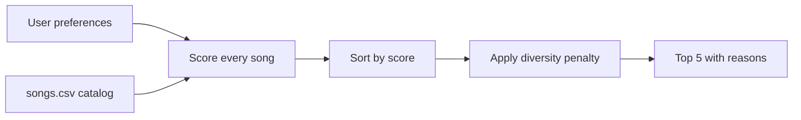

# Music Recommender Simulation

## Project Summary

**VibeCompass 1.0** is a CLI-first, content-based music recommender. It compares a
listener's stated taste with a catalog of 20 fictional songs, scores every song,
and displays five ranked choices with the exact points behind each result. It also
supports three ranking modes and applies a small diversity penalty to repeated
artists and genres.

## How Real Recommendation Systems Work

Platforms such as Spotify and YouTube combine several kinds of evidence. User
history—likes, skips, replays, playlists, searches, and watch or listening
time—describes behavior. Song data—genre, mood, tempo, energy, audio features, and
sometimes text—describes content. **Collaborative filtering** finds patterns among
people with similar behavior (“listeners like you also played this”), while
**content-based filtering** finds items whose attributes resemble things a person
already likes. Large systems combine both approaches, create candidate items, and
then rank those candidates. The inputs are data and preferences; the ranking score
is the process; the selected top items are the output.

## How This System Works

Each song has an ID, title, artist, genre, mood, energy, tempo, valence,
danceability, acousticness, popularity, release decade, instrumentalness,
speechiness, and liveness. A user profile contains a target genre, mood, energy,
optional numerical targets, and a ranking mode.

The balanced algorithm recipe is:

- Genre match: +2.0 points.
- Mood match: +1.5 points.
- Energy: up to +2.0 points using `1 - absolute difference`.
- Tempo: up to +1.0 point, reduced gradually as BPM gets farther away.
- Each optional audio-feature target: up to +0.5 points using closeness.
- Release-decade match: +0.5 points; optional popularity: up to +0.5.
- Repeated artists lose 0.75 and repeated genres lose 0.25 during top-k selection.

`genre_first` increases genre to 3.5 points. `energy_focus` increases energy to
4.0 points. A scoring rule judges one song; a ranking rule sorts all judged songs
and selects the top results. These are separate because a correct individual score
does not by itself create an ordered recommendation list.



## Getting Started

Python 3.10 or newer is recommended.

```bash
python -m venv .venv
# Windows:
.venv\Scripts\activate
# macOS/Linux:
source .venv/bin/activate

pip install -r requirements.txt
python -m src.main
```

Run the tests:

```bash
pytest -q
```

Verified test result:

```text
........                                                                 [100%]
8 passed in 0.02s
```

## Sample Recommendation Output

The program displays a full ASCII table. These compact transcripts preserve the
same titles, scores, and explanations from the verified run.

### High-Energy Happy Pop

```text
1. Sunrise City    6.68 — genre match (+2.0); mood match (+1.5); energy similarity (+1.84); tempo similarity (+0.90); danceability similarity (+0.45)
2. Gym Hero        5.14 — genre match (+2.0); energy similarity (+1.94); tempo similarity (+0.96); danceability similarity (+0.49); diversity penalty (-0.25)
3. Rooftop Lights  4.64 — mood match (+1.5); energy similarity (+1.72); tempo similarity (+0.96); danceability similarity (+0.46)
4. Island Morning  4.11 — mood match (+1.5); energy similarity (+1.52); tempo similarity (+0.60); danceability similarity (+0.48)
5. Chrome Pulse    3.19 — energy similarity (+1.88); tempo similarity (+0.83); danceability similarity (+0.48)
```

### Chill Acoustic Lofi

```text
1. Library Rain        6.42 — genre match (+3.5); mood match (+1.0); energy similarity (+0.95); tempo similarity (+0.48); acousticness similarity (+0.48)
2. Midnight Coding     6.02 — genre match (+3.5); mood match (+1.0); energy similarity (+0.88); tempo similarity (+0.48); acousticness similarity (+0.40); diversity penalty (-0.25)
3. Focus Flow          4.07 — genre match (+3.5); energy similarity (+0.90); tempo similarity (+0.47); acousticness similarity (+0.44); diversity penalty (-1.25)
4. Spacewalk Thoughts  2.90 — mood match (+1.0); energy similarity (+0.98); tempo similarity (+0.42); acousticness similarity (+0.49)
5. Blue Window         1.91 — energy similarity (+0.98); tempo similarity (+0.46); acousticness similarity (+0.46)
```

### Deep Intense Rock

```text
1. Storm Runner    7.80 — genre match (+1.0); mood match (+1.0); energy similarity (+3.84); tempo similarity (+1.47); liveness similarity (+0.49)
2. Gym Hero        6.46 — mood match (+1.0); energy similarity (+3.92); tempo similarity (+1.23); liveness similarity (+0.31)
3. Chrome Pulse    5.74 — energy similarity (+3.96); tempo similarity (+1.42); liveness similarity (+0.35)
4. Fireline        5.37 — energy similarity (+3.84); tempo similarity (+1.08); liveness similarity (+0.44)
5. Rooftop Lights  4.62 — energy similarity (+3.24); tempo similarity (+1.11); liveness similarity (+0.28)
```

### Adversarial Sad Workout

```text
1. Chrome Pulse       5.12 — genre match (+2.0); energy similarity (+1.98); tempo similarity (+1.00); valence similarity (+0.15)
2. Storm Runner       3.19 — energy similarity (+1.92); tempo similarity (+0.93); valence similarity (+0.34)
3. After the Goodbye  3.12 — mood match (+1.5); energy similarity (+0.86); tempo similarity (+0.29); valence similarity (+0.47)
4. Gym Hero           3.02 — energy similarity (+1.96); tempo similarity (+0.87); valence similarity (+0.19)
5. Fireline           2.99 — energy similarity (+1.92); tempo similarity (+0.67); valence similarity (+0.40)
```

## Experiment

I tested the requested weight shift through two selectable modes. `genre_first`
raises genre from 2.0 to 3.5 and reduces energy from 2.0 to 1.0, which keeps all
three lofi tracks near the top for the chill profile. `energy_focus` cuts genre to
1.0 and doubles energy from 2.0 to 4.0; this lets EDM and metal join rock for the
intense profile. The change made the results more responsive to physical intensity,
but less strict about genre. The math remains bounded because every similarity is
clamped between zero and one.

## Limitations and Risks

The catalog is tiny and fictional, so its coverage cannot represent real listening
taste. Exact text matches treat related labels such as “indie pop” and “pop” as
different. Hand-chosen weights encode the designer's assumptions, and a listener
with conflicting preferences may receive a technically consistent but emotionally
odd result. The diversity penalty reduces repetition but may lower the score of an
otherwise excellent match.

## Reflection

My biggest learning moment was seeing that ranking is separate from scoring:
judging one track correctly is not enough until every track is compared under the
same rule. AI help was valuable for drafting the repetitive CSV rows and identifying
edge cases, but I needed to verify types, score bounds, explanation text, and actual
rank order with tests. A simple weighted formula can feel personal because its
reasons correspond to recognizable musical qualities, even though it knows nothing
about a person's real history. Next I would learn weights from feedback and use a
larger, real catalog.

See the completed [Model Card](model_card.md) and
[AI Interactions Log](ai_interactions.md).
